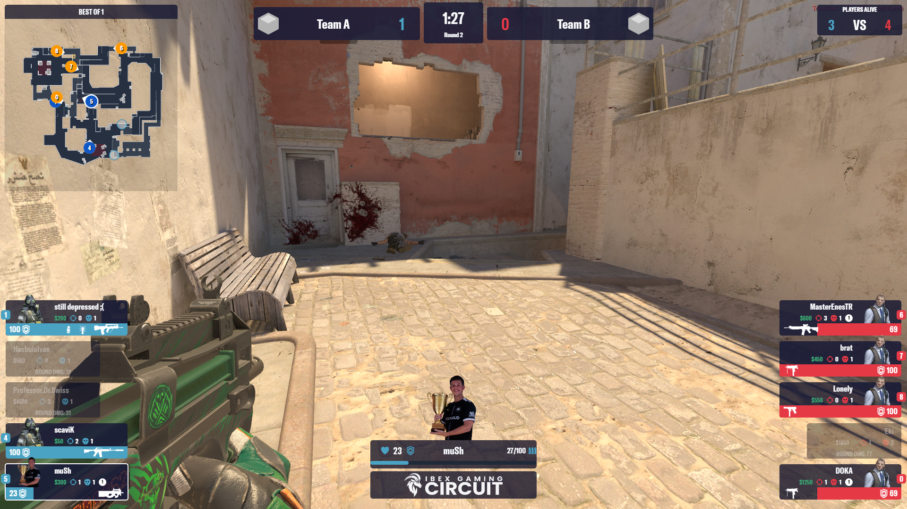
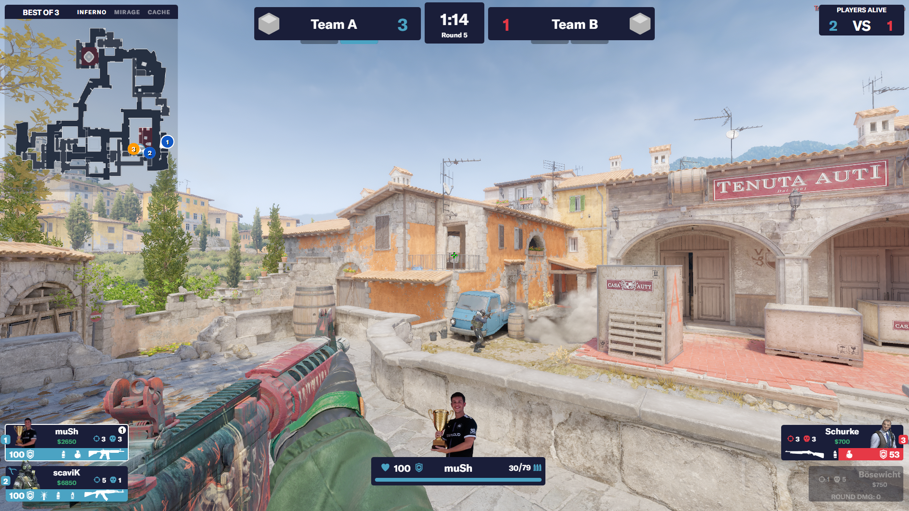

# Ibex Gaming Circuit CS2 Hud
This is the official Ibex Gaming Circuit HUD for JohnTimmermann/OpenHud

## Preview

## Fonts
- Option 1: GT America (bring your own)
- Option 2: Poppins (bring your own)
- Option 3: Monserrat (included)

## Usage
Extract the newest release zip and place the contents into the HUD Directory of OpenHud.
Standard - *C:\Users\{username}\OpenHud-Huds*

If you can't find the folder, go to OpenHud Settings and click "Open Directory".
